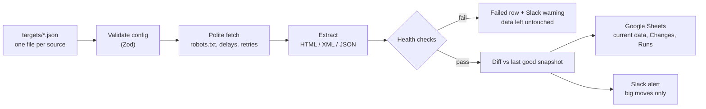

# scrape-pipeline

**A scheduled web data monitor that tells you what changed, and refuses to report success over bad data.**

Point it at a website, an XML feed or a JSON API. Every run it pulls the data, checks the data is
sane, compares it with the last good run, and logs every new, removed and changed row to Google
Sheets. Slack only hears about the changes that matter, biggest move first.

**[Open the live Google Sheet](https://docs.google.com/spreadsheets/d/1IRCSdaUuFZKBOvFb3qUEo_snI_PP89MkZhrNpmrdIgk/edit)**
(view only). The pipeline writes to it every weekday: current data, the change log, and every run.

## What an alert looks like

This is the real first change it caught in production: the European Central Bank's daily exchange
rates, 29 currencies updated, with a 0.5% alert threshold.

```
ecb-rates: 0 new, 0 removed, 29 updated

Updated: KRW: rate 1590.76 → 1554.55 (−2.3%)
Updated: HUF: rate 364.28 → 361.58 (−0.74%)
Updated: CHF: rate 0.9462 → 0.9393 (−0.73%)
Updated: ISK: rate 139.40 → 138.40 (−0.72%)
Updated: ILS: rate 3.4812 → 3.4593 (−0.63%)
Updated: THB: rate 38.225 → 37.988 (−0.62%)
Updated: PHP: rate 71.972 → 71.602 (−0.51%)
…plus 22 minor updates, listed in the Sheet
```

All 29 changes still land in the sheet's Changes tab. The alert just keeps the noise out of Slack.
A run with nothing worth saying sends nothing.

## Why it is different: it fails loudly

The classic scraper failure is quiet. The site changes its layout, the scraper starts returning
blanks, and the report still says "success". This pipeline checks every run before trusting it:

- a page failed to load
- zero items, or fewer than the target's expected minimum
- a field that came back empty on every item
- a field whose fill rate dropped more than 50 points since the last run (a selector broke)

Any of those fails the run. A failed run writes a `Failed` row to the Runs log, sends a Slack
warning, exits with code `1`, and **does not touch the data or the snapshot**. So a broken scrape
never logs your whole catalog as "removed", and the next good run picks up exactly where the last
good one left off.

## How it works



Runs on [Trigger.dev](https://trigger.dev) on a schedule (weekdays at 17:00 Berlin time). Each source
runs as its own parallel job with its own logs and status. It also runs from the command line or cron.

## Live sources

| Source | Type | What it tracks |
|---|---|---|
| European Central Bank reference rates | XML feed | 29 daily euro exchange rates |
| US CPSC product recalls (saferproducts.gov) | JSON API | 448+ recalls in 2026: new recalls and edits |
| books.toscrape.com | HTML, 3 pages | 60 products: price and stock changes |
| quotes.toscrape.com | HTML, 10 pages | 100 quotes |

## Google Sheet output

| Tab | Contents |
|---|---|
| One tab per source | The current dataset, replaced on every healthy run. Prices and decimals stored as numbers. |
| **Changes** | Append-only log: when, source, New / Removed / Updated, item, field, before, after |
| **Runs** | One row per run: item count, change counts, fill rate per field, Passed / Failed |
| Snapshot tabs (hidden) | The last good run, which the next run diffs against. No database needed. |

A new source gets its tabs created automatically on its first run.

## Adding a source

Drop a JSON file in `targets/` and register it in `src/targets.ts`. No other code changes.

```json
{
  "name": "books-demo",
  "sheetTab": "Books",
  "startUrl": "https://books.toscrape.com/catalogue/page-1.html",
  "maxPages": 3,
  "itemSelector": "article.product_pod",
  "fields": {
    "title": { "selector": "h3 a", "attr": "title" },
    "price": { "selector": "p.price_color" },
    "availability": { "selector": "p.instock.availability" }
  },
  "key": "title",
  "nextPageSelector": "li.next a",
  "minItemsExpected": 40,
  "alerts": { "minChangePct": 5 }
}
```

- `key` is the field that identifies an item across runs. The diff is keyed on it.
- `"format": "xml"` or `"format": "json"` switches from CSS selectors to XML elements or dotted JSON
  paths (`"Products.0.Name"`).
- `alerts.minChangePct` sets how far a number must move to alert. Text changes such as
  `In stock` → `Out of stock` always alert. `alerts.ignore` lists fields that never alert.

The full field reference is in [CLAUDE.md](CLAUDE.md).

## Run it

Requires Node.js 24+ (it runs TypeScript directly, so there is no build step).

```bash
npm install
npm start                          # the books demo
npm run all                        # every registered source, in parallel
npm run run -- --target ecb-rates  # one source by name
npm test                           # unit tests
npm run typecheck
```

Run it twice to see change detection; the first run saves the baseline.

With no environment variables set, it keeps its snapshot in `data/` and prints the report to the
terminal. To write to Google Sheets and Slack, create a `.env`:

```bash
SCRAPE_PIPELINE_SERVICE_ACCOUNT_EMAIL=...          # a Google service account shared on the sheet as Editor
SCRAPE_PIPELINE_SERVICE_ACCOUNT_PRIVATE_KEY="..."  # its private key
SCRAPE_PIPELINE_SHEET_ID=...
SCRAPE_PIPELINE_SLACK_WEBHOOK_URL=...              # a Slack incoming webhook
```

## Built to be a good citizen

- Reads and obeys `robots.txt`, including `Crawl-delay`
- Waits between requests and backs off on `429` and `5xx` responses
- Identifies itself with a descriptive User-Agent
- Public data only: nothing behind a login, no CAPTCHA solving, no bot-protection bypass
- Prefers an official API or feed over scraping HTML whenever one exists

## Security details

- Scraped values are written to Sheets as raw text, so a value starting with `=` can never run as a formula.
- Slack messages are escaped, so scraped text cannot ping `@channel` or fake a link.
- Errors never print the Slack webhook URL or the private key.
- Google auth signs its own JWT with Node's built-in crypto: no Google client library.

## Tech stack

Node.js 24 + TypeScript · Cheerio · Zod · robots-parser · Trigger.dev · Google Sheets REST API ·
Slack incoming webhooks. Four runtime dependencies in total; HTTP is Node's built-in `fetch`.

## License

[MIT](LICENSE)
